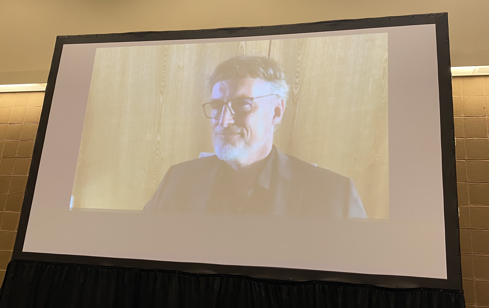

We are very delighted to share with the research community that the first Gaze Meets ML workshop successfully took place at [NeurIPS](https://nips.cc/Conferences/2022/ScheduleMultitrack?event=49990) in New Orleans on December 3rd, 2022. This one-day event was attended by more than 50 participants.

We had the honor to host [Prof. Jürgen Schmidhuber](https://people.idsia.ch/~juergen/) as a remote keynote speaker inaugurating the workshop and offering a history of the efforts on visual attention in machine learning. During his talk, Prof. Schmidhuber started the discussion with the attentive neural networks proposed in the 90s that mimic foveas and learn internal spotlights of attention in a fashion of early Transformer-like systems. He then continued the discussion by offering insights on the research related to representing percepts and action plans in hierarchical neural networks, at multiple levels of abstraction, and multiple time scales, which are key mechanisms of complex activities such as visual attention. 
 

During the day we had the opportunity to have [speakers](https://gaze-meets-ml.github.io/gaze_ml_2022/speakers/) present visual attention research from diverse backgrounds. Specifically, Associate Prof. Claudia Mello-Thoms from the University of Iowa presented work on eye tracking for radiology through a large study. Prof. Miguel P. Eckstein from the University of California, Santa Barbara offered insights on the interpretation of volumetric radiology images using eye tracking. Assistant Prof. Tobias Gerstenberg from Stanford University provided **MISSING**. Finally, Assistant Prof. Scott W. Linderman from Stanford University presented neuroscience **MISSING**

Overall, we had 7 oral presentations and 11 poster presentations covering various research areas of visual attention from utilizing gaze in federated settings to benchmark datasets that assess the locus of a participant's overt visual attention. The audience size allowed us to host a 1-hour breakout session. This offered a unique opportunity to have small group discussions on a variety of topics raised by the participants. Topics included *"Fairness in gaze estimation"*, *"Understanding peripheral visual attention"*, and *"Annotating through eye gaze: from explicit to implicit annotation"*. This direct involvement was a centerpiece to the nature of the workshop by enabling interaction and idea exchange between multi-disciplinary experts from the workshop audience. 
 

Thanks to the generous support of our main sponsor, [Gazepoint](https://www.gazept.com/), we were able to provide 2 high-end [GP3 Eye Trackers ](https://www.gazept.com/product/analysis-ultimate-bundle/) to the Best Paper Award winners! These eye trackers came along with the Gazepoint Analysis UX Edition software that allows researchers to collect multimodal data out-of-the-box including eye tracking, voice, and face recording.  

The Gaze Meets ML workshop is focused on visual attention, an active multi-disciplinary area of research. With its first version, we believe that we managed to bring together diverse communities and build bridges of communication and understanding. Because of the strong interest and the potential for transformative research in visual attention and gaze-assisted machine learning, we are excited at the prospect of continuing this effort, hoping to strengthen this community and build the foundation for interdisciplinary impactful collaborations.

With kind regards, 
The organizing committee for the Gaze meets ML workshop
December 28, 2022
